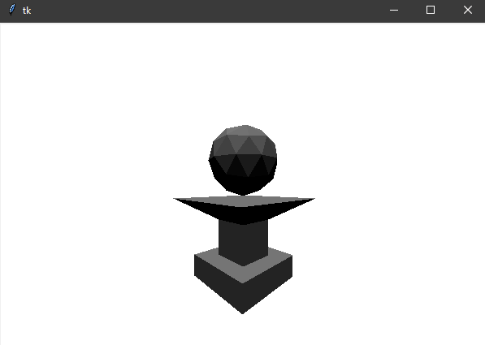
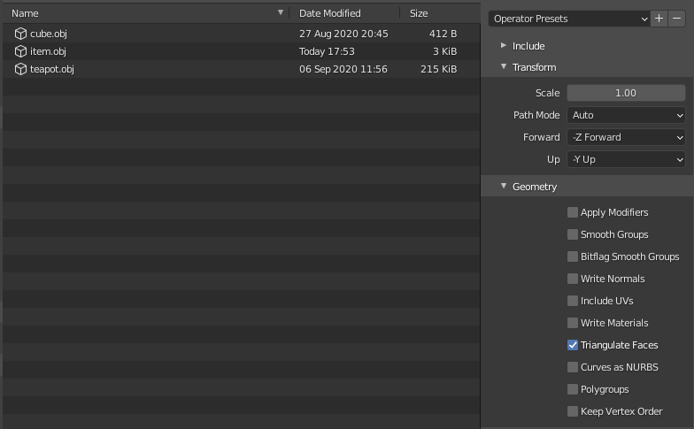

# python-3d-engine
Simple python and tkinter 3d engine made using [javidx9's](https://www.youtube.com/c/javidx9) tutorial series

# Importing objects
This program has a simple .obj importer. Only triangulated meshes and simplified files work currently. If you're using Blender, these export options will yield a working model.
Replace the path inside Engine3d.py with your file name: `my_mesh = Mesh(obj_to_triangles("../models/file_name_here.obj"))`.

# Controls
Use the WASD controls for movement, left and right keys for the camera, and space and control for moving up and down respectively.
